# 一、PHP基础语法

## 01.基础语法
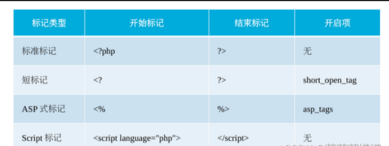
###    1.标记与注释

    标记：
    
     标准标记 <?php     ?>
    短标记 <?    ?>
    注意：在php7中，仅支持标准标记和短标记
    注释：
    单行注释  //输出一句话        #输出一句话
    多行注释  /* echo'hello,php'; echo100 +200;*/
    注意：多行注释中可以嵌套单行注释，但不能再嵌套多行注释。


###    2.输出语句

    echo: 可将紧跟其后的一个或多个字符串、表达式、变量和常量的值输出到页面中，多个数据之间使用逗号‘’，‘分隔
    print：与echo的用法相同，唯一的区别是print只能输出一个值
    print r()：PHP的内置函数，它可输出任意类型的数据，如字符串、数组等
    var dump()：不仅可以打印有一个或多个任意类型的数据，还可以获取数据的类型和元素个数


###    3.PHP标识符

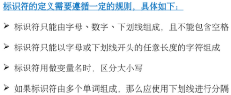    

 


###    4.PHP关键字

    

 

 

## 02.数据与运算

###    1.常量

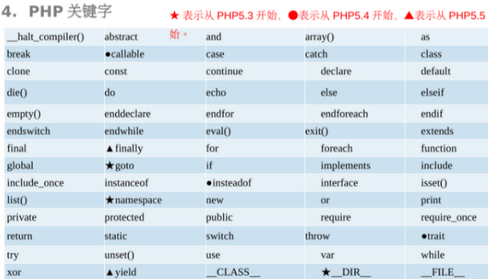                
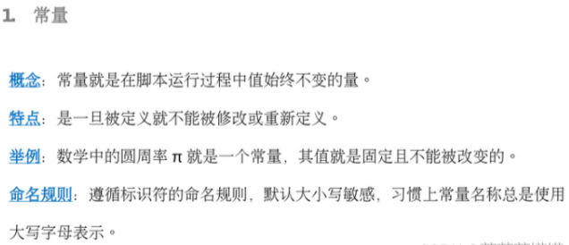 
```php
<?php 
// defing()函数  定义常量
    define('PAI','3.14');
    define('R','5',true);
    echo '圆周率=',PAI; //输出结果：圆周率=3.14
    echo '半径=',R; //输出结果：半径=5
// Const关键字  定义常量
    const A = 6;
    const P = 2*A;
    echo 'P=',P;//输出结果：P=12
 
?>
```
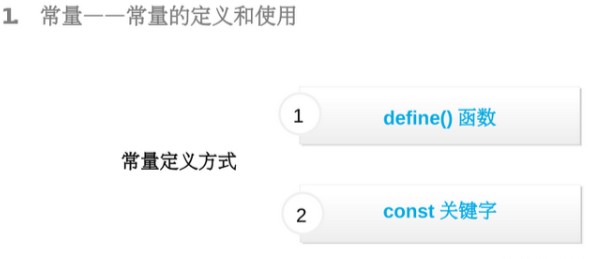
 


###    2.变量

    概念：变量就是保存可变数据的容器
    组成：是有$符号和变量名组成的，变量名命名规则与标识符相同
    由于PHP是一种弱语言，变量不需要事先声明，可以直接赋值使用
    实现方式：一种是默认的传值赋值，另一种是引用赋值
    传值赋值: 将‘=’左边的数据赋值为右边的变量
    引用赋值：在要赋值的变量前添加‘&’符号
    两种实现方式的区别：传值赋值方式当一个变量值发生改变时，不影响另一个变量；
        而引用赋值的方式，另一个变量会随之变化
    可变变量：
    概念：可以将另一个变量的值作为该变量的名称
    注意: 可变变量使用时可能会出现非法变量名的情况。如$a=1,则$$a是非法的
  


###    3.表达式

    在PHP中，任何有值的内容都可以理解为表达式
  
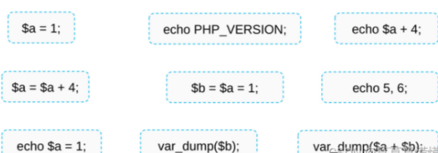
 


###    4.数据类型及转换

    PHP中变量的数据类型通常不是开发人员设定的，而是根据该变量使用的上下文在运行时决定的。
                 


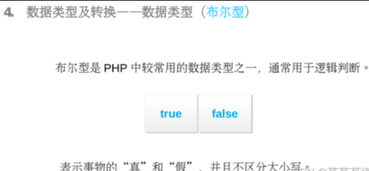

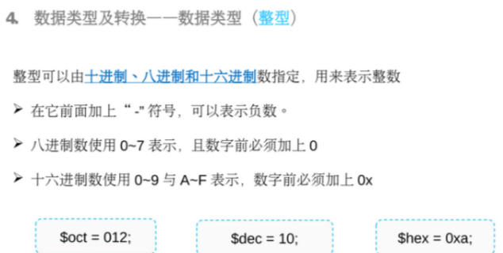

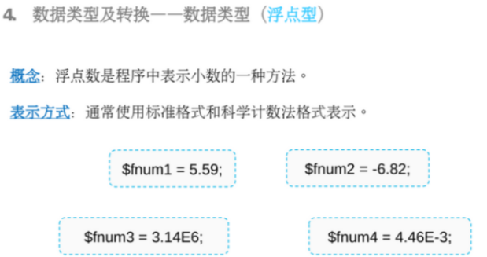


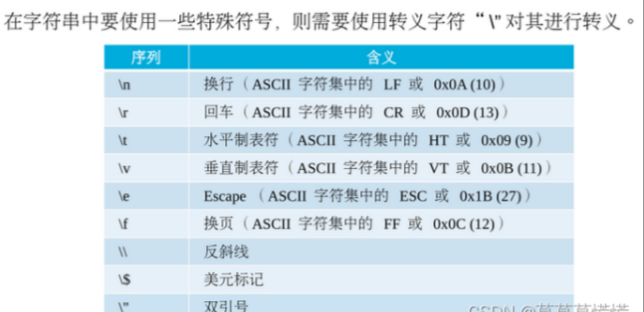 
```php
// PHP中变量的数据类型通常不是开发人员设定的，而是根据该变量使用的上下文在运行时决定的。
// 定义时
$a = 1;
var_dump($a); //输出结果： int(1)
//运算后
$a =$a +2.0;
var_dump($a); //输出结果：float(3)
```


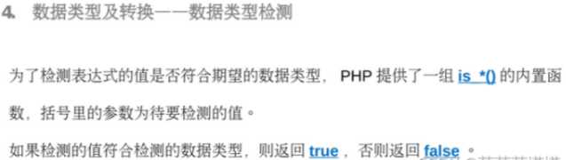

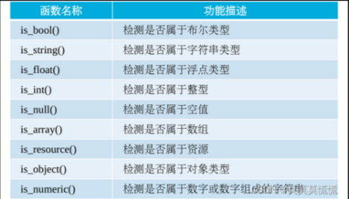
 
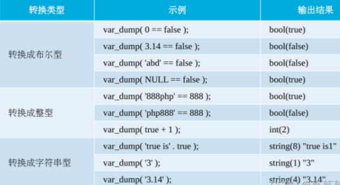
 

###    5.运算符及优先级
 
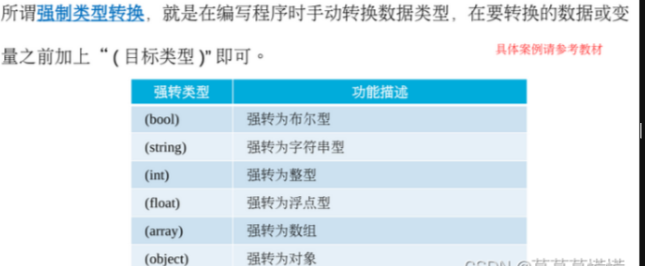
 

 
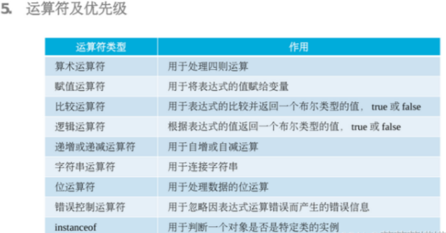
 
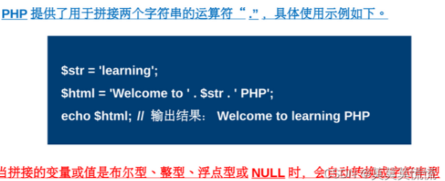
 
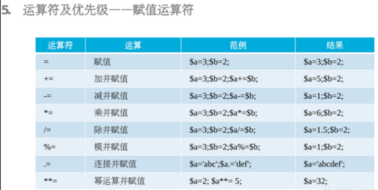
 
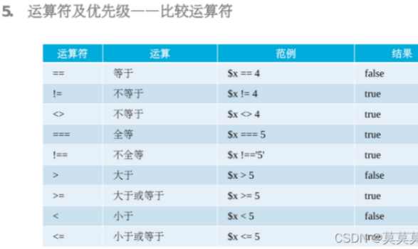
 
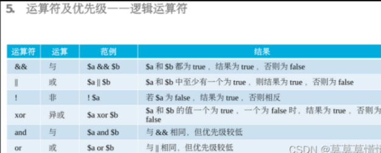
 
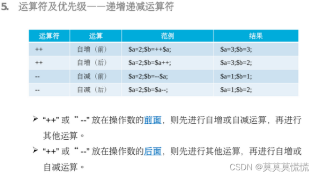
 
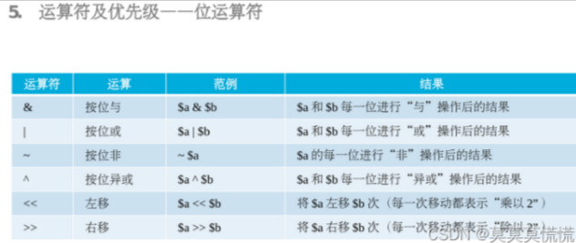
 
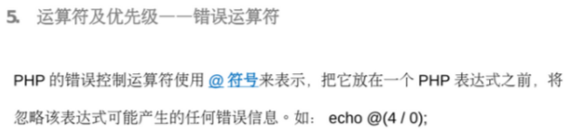
 
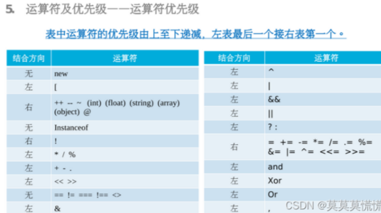
 

## 03.流程控制语句

    选择结构语句：

    1.选择结构语句--if单分支语句
    概念：当满足某种条件时，就进行某种处理
    2.选择结构语句--if...else语句
    也称为双分支语句，当满足某种条件时，就进行某种处理，否则进行另一种处理
                三元运算符：
    又称为三目运算符，它也可以完成if...else语句的功能
    条件表达式 ？ 表达式1 ：表达式2
     例如：echo $age >=18 ? '已成年':'未成年';
    先求条件表达式的值，如果真返回表达式1的执行结果，如果假则返回表达式2的执行结果
    当表达式1与条件表达式相同时，可以简写，省略中间的部分
    条件表达式？：表达式2
    3.选择结构语句--if...elseif...else语句
    4.选择结构语句--switch语句
    和if条件语句差不多，特点是：代码更清晰简洁、便于阅读


    循环结构语句：

    1.while循环语句
    概念：是根据循环条件来判断是否重复执行这一段代码的
    2.do...while循环语句
    概念：和while相似，唯一区别是：while是先判断后执行循环体，而do...while会先执行一次循环体在判断
    3.for循环语句
    概念： for循环语句是最常用的循环语句，它适合循环次数已知的情况

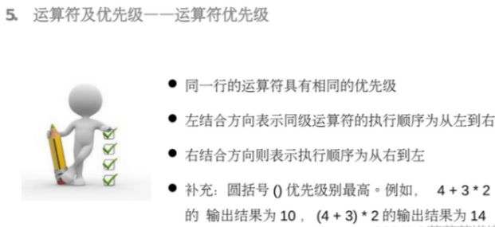

     跳转语句
 
    1.break
    可应用在Switch和循环语句中，其作用是终止当前语句的执行，跳出本次循环
    2.continue
    与break语句的区别在于，前者用于结束本次循环执行，开始下一轮循环的操作，后者是终止当前循环，跳出循环体。

    流程替代语法

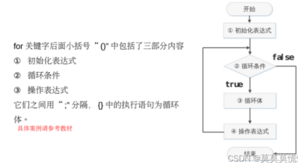

 
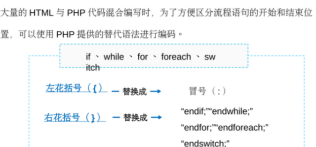
 

## 04.文件包含语句
    
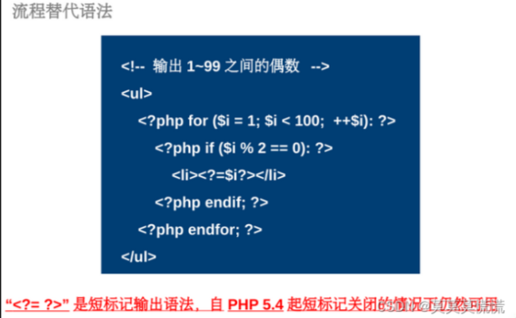

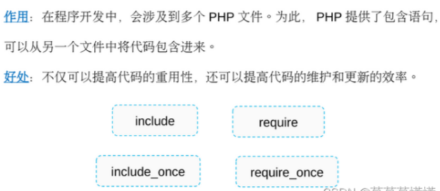

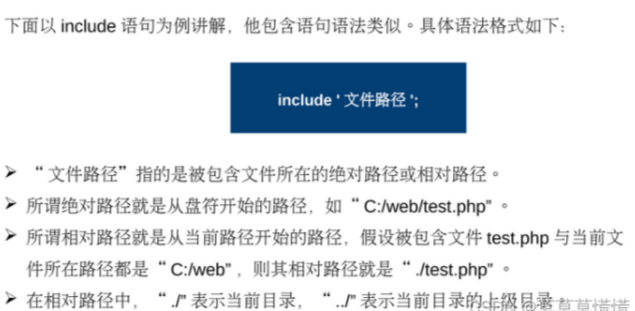