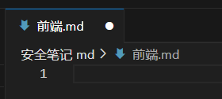
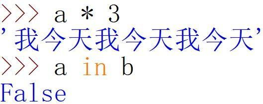
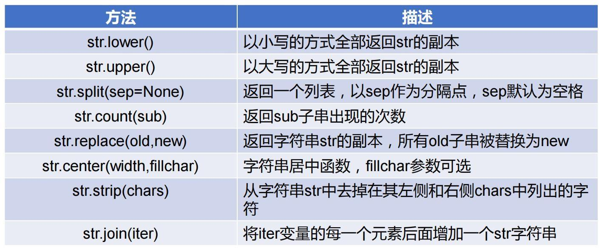

# 第一章 认识 Python
在正式开始学习 Python 编程这门课之前，我们先来讲一个概念：计算思维。 
计算思维的本质是抽象和自动化。我们来举个例子简单理解一下什么是计算思维： 
【高斯求和】 
德国著名数学家高斯幼年时代聪明过人，上学时，有一天老师出了一道题让同学们计算： 

1＋2＋3＋4＋…＋99＋100＝？ 

老师出完题后，全班同学都在埋头计算，小高斯却很快算出答案等于 5050。高斯为什么算
得又快又准呢？原来小高斯通过细心观察发现： 

1＋100＝2＋99＝3＋98＝…＝49＋52＝50＋51。 

1～100 正好可以分成这样的 50 对数，每对数的和都相等。于是，小高斯把这道题巧算为 

（1+100）×100÷2＝5050。

小高斯使用的这种求和方法，简单快捷，并且广泛地适用于“等差数列”的求和问题。
这就是典型的逻辑计算思维。把数学问题转化为程序编写，如下： 
这种依托计算机，通过抽象和自动化方式求解问题的思维方式体现为计算思维。在学习编程
的过程中，计算思维对于分析问题和解决问题尤为重要。
## 一、计算机编程
不知道大家有没有一个疑问，为什么要学习计算机编程？下面这里给大家列出来了一些学习编
程的好处： 

**锻炼 增进 提高 带来 促进**
**思维 认识 效率 乐趣 就业**

由此可见，学习编程的好处颇多。但是在我们的认知里，编程实在是太难了！学不会呀！ 
那是因为你还没有掌握好的学习方法，编程中需要记忆的理论知识很少，实际应用才是王道，代
码光看也是没有用的，最重要的就是多练习，多敲几遍。这套学习方法适用于学习所有的编
程语言。 
那么我们可以学习的编程语言都有哪些呢？例如 java，c，c++，pascal，python 等等，这
些语言又叫高级语言，而高级语言与机器语言、汇编语言都可以被称为程序设计语言。 
## 二、程序设计语言   

### （一）程序设计语言概述
既然提到了程序设计语言，那么我们就先来简单了解一下它的概念。 
程序设计语言是**计算机**能够理解和识别用户操作意图的一种交互体系，它按照特定规则组织
计算机指令，使计算机能够自动进行各种运算处理。程序设计语言也叫编程语言。 

**计算机程序是按照程序设计语言规则组织起来的一组计算机指令。** 
程序设计语言发展经历了**机器语言、汇编语言到高级语言**的 3 个阶段。其中，机器语言和
汇编语言都是直接操作计算机硬件的编程语言，这两类语言与具体 CPU 结构相关，不是当
今程序设计主流方式，高级语言在当前使用比较广泛。 
那你知道与程序设计语言相对的语言叫什么吗？没错，就是自然语言，也就是我们日常说的
话。不知道大家有没有想过，为什么我们不能直接使用自然语言来编写程序呢？ 
因为自然语言具有不严密和模糊的缺点，需要交流双方具有较高的识别能力。而程序设计语
言字在语法上十分精密，在语义上定义明确，在规则上十分严格，进而保证了语法含义的唯
一性。 
### （二）高级语言的编译与解释   
我们再来聊一聊现在使用最多的高级语言。由于高级语言不能被计算机直接执行，因此在执
行之前必须要先把它转换成 0 和 1 的形式，转换的方式有两种：**编译和解释**。 
高级语言根据计算机执行机制的不同分为两类：静态语言和脚本语言，静态语言采用编译方
式执行，脚本语言采用解释方式执行。 

**编译**是将源代码全部转换成目标代码最后再运行目标代码的过程。源代码是高级语言代码，
目标代码是机器语言代码，执行编译的计算机程序称为编译器。 
**解释**是将源代码逐句转换成目标代码同时逐句运行目标代码的过程。执行解释的计算机程序
称为解释器。 
编译和解释的区别在于：编译是一次性地翻译，一旦程序被编译，不再需要编译程序或者源
代码。解释则在每次程序运行时都需要解释器和源代码。 
**编译型**相当于厨师直接做好一桌子菜，顾客来了直接开吃，而**解释型**就像吃火锅，厨师把菜
洗好，顾客需要自己动手边煮边吃。 
采用编译方式执行的编程语言是静态语言，如 C 语言，Java 语言等；采用解释方式执行的
编程语言是脚本语言，如 JavaScript 语言、PHP 语言等。 
Python 语言是一种高级通用脚本编程语言，采用解释方式执行。但是 Python 有点特殊，它
的解释器也保留了编译器的部分功能，随着程序运行，解释器也会生成一个完整的目标代码
### （三）Python 语言的特点   
刚才提到了很多当前主流的高级编程语言，那么可能大家会问，我学习计算机编程为什么要
选择从 Python 开始呢？ 
首先，Python 语言是一种被广泛使用的高级通用脚本编程语言，具有很多区别于其他语言
的特点。
1. **面向对象：**在很多教材中，开篇对 Python 的定义就是，“Python 可以被定义为一种
面向对象的脚本编程语言”。没错，这算是 Python 语言最大的一个特点。 
面向对象与面向过程两者相对。 
面向对象简单来说就是以对象展开，输入的一切都是“对象”。面向对象就好像是一部纪传
体，人物（对象）可以穿梭在不同的时期（程序）。这就需要先分析需求，分解问题，再把
对象分别写好，需要的时候调用即可。 
面向过程简单来说就是需要走程序。面向过程就好像是一部编年体，没错，在这里你可以看
到详细的每一年人物（程序）是怎么生活（运行）的。这就需要在分析需求的同时列出所以
需要的步骤，依次运行程序，一步一步地实现需求。
2. **可移植性：**Python 可以移植到许多平台上，这样就可以实现在不同平台上的工作，这
些平台包括 Linux、Windows、Windows CE、以及 Google 基于 linux 开发的 android 平台
等等。 
3. **丰富的库：**Python 本身也会提供很多标准库来辅助用户进行各类程序开发，同时也支
持第三方库的安装，Python 强大的库可以满足数据分析、游戏开发、密码系统等多种需求。
4. **支持中文：**如果你是初次接触编程，那么支持中文开发的 Python 语言一定能让你更
快上手。 
5. **使用开源：**Python 同时也是一个自由、开放的源码软件，开源软件的源代码任何人都
可以审查、修改和增强，或者把它的一部分用于新的自由软件中。
6. **语法简洁：**Python 的语法简洁主要体现在它更接近自然语言，读起来简洁易懂，同时，
在同样的程序中 Python 所需的代码量更少，更少的代码行数、更简洁的表达方式可减少程
序错误以及缩短开发周期。
### （四）Python 语言的发展史   
Python 的创始人为 Guido van Rossum。1989 年圣诞节期间，在阿姆斯特丹，Guido 为了
打发圣诞节的无趣，决心开发一个新的脚本解释程序，作为 ABC 语言的一种继承。于是他
使用最爱的喜剧团体 Monty Python 的名字作为该编程语言的名字。 
1991 年，第一个 Python 编译器（同时也是解释器）诞生。 
它是用 C 语言实现的，并能够调用 C 语言的库文件。从一出生，Python 已经具有了：类 
(class)，函数(function)，异常处理(exception)，包括表(list)和词典(dictionary)在内的核心数
据类型，以及模块(module)为基础的拓展系统。
那么现如今 Python 发展的怎么样了呢？得益于人工智能时代的到来，Python 发展的不差。 
三年前，Matlab、Scala、R、Java 和 Python 在 AI 和大数据开发领域各领风骚，蓬勃发
展，然而三年之后，趋势已经非常明确了，Python 作为 AI 时代头牌语言的位置基本确立，
未来的悬念仅仅是谁能坐稳第二把交椅。不过市场上也有热衷 Java 的声音，因为 Hadoop

等大数据基础设施是用 Java 写的。 
而 Python 快速发展最根本的原因只有一点：Python 是众多主流语言中唯一一个战略定位
明确，而且始终坚持原有战略定位不动摇的语言。Python 的战略定位是什么？其实很简单，
就是要**做一种简单、易用但专业、严谨的通用组合语言**，或者叫胶水语言，让普通人也能够
很容易的入门，把各种基本程序元件拼装在一起，协调运作。 
任何一个人，只要愿意学习，可以在几天的时间里学会 Python 基础部分，然后干很多很多
事情，这种投入产出比可能是其他任何语言都无法相比的。这也是我们选择 Python 的原因。由
此，对于 Python 的介绍就结束了。希望本次 Python 编程学习之旅，能给你带来满满的 
干货和不一样学习感受。下面就让我们正式开始旅程吧！ 
# 第二章 下载与使用 Python 解释器   

## 一、安装 Python   

## 二、 使用 Python   

### （一）运行 Python 的集成开发环境   

### （二）下载安装第三方库   
可以动手尝试安装 jieba 库： 

**1. 安装 jieba 库：**pip install -i https://pypi.douban.com/simple/ jieba 

**2. 升级 pip 工具：**python -m pip install -i https://pypi.douban.com/simple/ --upgrade pip 

升级完之后就不会提示：You should consider upgrading via the 'python -m pip install --upgrade pip' command. 

**上面的代码实际上是使用了豆瓣源来进行安装和更新，这里代码是有固定格式的：**

**1. Python 如何豆瓣源更新 pip：**

菜单栏搜索 cmd，右键以管理员权限打开，复制以下命令过去，回车执行。 

python -m pip install -i https://pypi.douban.com/simple/ --upgrade pip 

**Python 如何豆瓣源安装库：**

菜单栏搜索 cmd，右键以管理员权限打开，复制以下命令过去，将需要下载的模块名修改， 
回车执行。 

pip install -i https://pypi.douban.com/simple/ 模块名 

### （三） 卸载与重装 Python   
在电脑中搜索【控制面板】，选择卸载程序，右键卸载 Python3.7。 
### （四） 编写第一个 Python 程序   
1. IPO 程序编写方法 
每个计算机程序都用来解决特定计算问题，较大规模的程序提供丰富的功能，解决完整计算
问题，例如控制航天飞机运行的程序、操作系统等。小型程序或程序片段可以为其他程序提
供特定计算支持，作为解决更大计算问题的组成部分。无论程序规模如何，每个程序都有统
一的运算模式：输入数据、处理数据和输出数据。这种朴素的运算模式形成了程序的基本编
写方法：IPO 方法。 
2. Python 最小程序 
学习编程语言有一个惯例，即编写第一个程序语言是：在屏幕上打印“Hello World”。这
个程序虽小，确实每个初学者了解编程的第一步。 
```python
>>> print(‘Hello world!’) 
```
Hello world! 
其中“>>>”是 Python 语言环境的提示符，表示可以在此符号后输入 Python 语句。第二行是 
Python 语句的执行结果。 
我们说 Python 是支持中文的编程语言，那么再来试试输出一段中文： 
```python
>>> print("你好，世界！”) 
```
你好，世界！ 
需要注意的一点是，编写程序的时候应该是英文标点，如果出现中文标点那么程序就会报错，引号
内的除外。
# 第三章 Python 的基本语法   

## 一、程序的格式框架   

### （一）缩进   
缩进指每行语句开始前的空白区域，用来表示 Python 间的**包含和层次关系。**
一般代码不需要缩进，顶行编写且不留空白。当表示**分支、循环、函数、类等**程序含义时，
在 **if、while、for、def、class** 等关键字所在完整语句后通过英文冒号（:）结尾并在之后
进行缩进，表明后续代码与紧邻无缩进语句的所属关系。 
代码编写中，缩进可以用【Tab】键实现，也可以用多个空格（一般是 4 个）实现，但两者
不可混用。如下图，框起来的地方就是缩进。 

### （二）注释   
注释是代码中的辅助性文字，一般用于程序员对代码的说明。Python 程序中的非注释语句
将按顺序执行，注释语句将被解释器过滤掉，不被执行。 

Python 采用（#）表示一行注释的开始，文档注释是三个单引号(''')或三个双引号(""")。 
### （三）续行符   
Python 程序是逐行编写的，每行代码长度无长度限制。但有的时候一句话过长，放在一行
会造成阅读困难，那么我们可以使用续行符解决这个问题。 
续行符由反斜杠（\）符号表达。
注意：续行符后不能存在空格，续行符后必须直接换行。 
续行符不仅可以用于单行代码较长的情况，也适合对代码进行多行排版增加可读性的情况。  
## 二、基本语句   

### （一）基本输入输出   
**1. input()：输入函数**
使用方式：<变量> = input(<提示性文字>) 
无论用户输入的是字符还是数字，input()函数统一按照字符串类型（str）输出。 
**2. eval()** 
使用方式：<变量> = eval(<字符串>) 
去掉字符串最外侧的引号，并按照 Python 语句方式执行去掉引号后的字符内容，通常会和 
input 函数一起使用。 
**3. print()：输出函数** 
使用方式： 
❶ 仅输出字符串：print(<待输出字符串>) 
❷ 仅用于输出一个或多个变量：print(<变量 1>,<变量 2> ....... <变量 n>) 
❷ 用于混合输出字符串与变量值： 
print(<输出字符串模板>.format(<变量 1>,<变量 2> .......<变量 n>)) 
print()函数输出文本时默认在最后增加一个换行，如左下图，两句话在两行输出。 
如若不希望在最后增加换行，或者是想要输出其他内容，可以对 print()函数的 end 参数值进
行赋值。 

### （二）分支语句   
分支语句是控制程序运行的一种语句，它的作用是根据判断条件选择程序执行路径。分支语
句包括单分支、二分支和多分支。 

 

**1. 单分支语句**
``` python
使用方式： 
if <条件>: 
<语句块> 
```
任何能够产生 True 或 False 的语句都可以作为条件，当条件为真时，执行语句块中的内容。 
**2. 二分支语句** 
```python
使用方式： 
if <条件>: 
<语句块 1> 
else: 
<语句块 2> 
```
当条件为 True 时，执行语句块 1；当条件为 False 时，执行语句块 2。 
**3. 多分支语句**
使用方式：
```python
if <条件 1>: 
<代码块 1> 
elif <条件 2>: 
<代码块 2> 
elif <条件 3>: 
<代码块 3> 
... ... 
else: 
<代码块 n> 
```
多分支结构一般用于判断同一个条件或一类条件的多个执行路径。依次判断条件并执行对应
的语句。若没有条件成立，执行 else 下面的语句。 
### （三）循环语句   
循环语句是控制程序的一类重要语句，它的作用是**根据判断条件确定一段程序是否再次执行一次或者多次**。循环包括：条件循环和遍历循环。 
**1. 条件循环语句** 
使用方式： 
while (<条件>): 
    <语句块 1> 
<语句块 2> 
当条件为 True 时，执行语句块 1，然后再次判断条件，当条件为 False 时，退出循环，执
行语句块 2。 
**2. 遍历循环语句** 
使用方式： 
for <循环变量> in <遍历结构>: 
    <语句块> 
从遍历结构中逐一提取元素，放在循环变量中，对于每个提取的元素执行一次语句块。 
for 循环经常和 range()函数一起使用，基本使用方式如下： 
for <循环变量> in range(<循环次数>): 
<语句块>
## 三、基本语法元素   

### （一）引用   
Python 适用于各个领域，其最大的魅力就在于它可以使用大量的外部函数库。  
**1. import 语句** 

使用方式： 
import <库名 1> 
import <库名 2> 
... ... 
import <库名 n> 

**2. from 方式** 

将模块中指定的属性或名称导入当前程序命名空间。 
使用方式： from <库名> import <函数名> 

同时，Python 也支持为功能库起别名。
使用方式： import <功能库名> as 别名 

**采用 import 和 from 两种命名方式的区别在于：** 

①采用 import 方式，用户自定义的函数名字可以和库中函数的名字一样； 
②采用 from 方式，用户程序中不能用函数库中的名字定义函数。
### （二）命名规则 
标识符是用户编程时使用的名字，用于给变量、常量、函数、语句块等命名。标识符是由一
串字符串组成，这个字符串可以是任意字母、数字、下划线或汉字，**但是不能以数字开头。** 
同时，也**不能与关键字同名**，关键字也被称为“保留字”。 
Python 有 33 个保留字，分别为：and，def，del，elif，else，except，False，finally，for， 
from，global，as，assert，break，class，continue，if，import，in，is，lambda，None， 
nonlocal，not，or，pass，raise，return，True，try，while，with，yield。
### （三）变量   
在标识符中，在运行过程中可以被修改的量被称为变量。 
1. 表达式 
产生或计算新数据值的代码片段称为表达式，一般由数据和操作符等构成。 
2. 赋值语句 
对变量进行赋值的一行代码被称为赋值语句。
语法格式： <变量> = <表达式> 
### （四）常量   
一旦赋值就不能改变值的标识符，Python 中无法定义常量。 
# 第四章 基本数据类型   
计算机对数据进行运算时需要明确数据的类型和含义。Python 语言支持多种数据类型。 
## 一、数字类型   
表示数字或数值的数据类型称为数字类型。 
Python 提供 3 种数字类型：整数、浮点数和复数。
### （一）整数类型   
整数类型概念与数学中整数的概念一致，理论上的取值范围是[-∞,+∞]。实际上 Python 支持
任意大的数字，只受计算机内存大小限制。 
整数类型有 4 种进制表示：十进制、二进制、八进制和十六进制 
进制只是整数值表示的展现形式，用于辅助程序员更好地开发程序，计算机处理时，只要数
值相同就无区别。 
**（1） 整数的不同进制之间可以相互转化**

bin(x)：将 x 转换为二进制整数 

oct(x)：将 x 转换为八进制整数 

int(x)：将 x 转换为十进制整数 

hex(x)：将 x 转换为十六进制整数 

**（2） 不同数据类型之间可以相互转化**

type(x)：对 x 变量进行类型判断，适用于任何数据类型。 

int(x)：将 x 转换为整数类型 

float(x)：将 x 转换为浮点数类型 
 
str(x)：将 x 转换为字符串类型

### （二）浮点数类型   
浮点数类型与数学中实数的概念一致，表示带有小数的数值。Python 语言中要求浮点数类
型必须带有小数部分，小数部分可以是 0。有两种表示方法：一般表示法和科学计数法。 
**（1） 整数的运算精度比浮点数高。这里使用 pow()函数进行一个示例。 pow(x,n)=xn**
```python
>>> pow(1010,25) 
12824319950172336135927520292983899763256730300250100000000000000000000 
00000 
>>> pow(1010.0,25) 
1.2824319950172337e+75 
```
**（2） 存在不确定尾数问题**
受限于计算机表示浮点数使用的存储宽度，计算的二进制数并不是 0.1 和 0.2 而是计算机内 
部最接近 0.1 和 0.2 的二进制数。求得的数反映到十进制表示上，就会产生一个不确定尾数，至
于尾数是多少，计算机内部会根据二进制运算确定产生。 
>>> 0.1 + 0.2 
0.30000000000000004 
浮点数大都是一个近似的值，为解决不确定尾数问题，我们可以使用 round()函数保留几位
小数。 
round(x,n)：对数值 x 保留 n 位 
>>> round(0.30000000000000004,2) 
0.3 
### （三）复数类型   
复数类型表示数学中的复数。复数有一个基本单位元素 j，被定义为 j = −1。含有虚数单位 j
的数被称为复数。Python 中，复数被看为二元有序实数对(a,b)，表示 a+bj，虚部通过 j 或 
J 表示。例如：3+4j，-2+5.6j ... ... 
需要注意的是，如果一个复数的虚部 b 为 1，那么 1 也是不能省略的，即 1j 表示虚部。 
复数类型中实部和虚部都是浮点类型，对于复数 z，可以用 z.real 和 z.imag 分别获得实数
部分和虚数部分。 
>>> (3+4j).real 
3.0 
>>> (3+4j).imag 
4.0 

### （四）数字类型的运算   
**1. 数值运算操作符**
基本规则： 
整数之间运算，产生结果类型与操作符相关；
整数和浮点数混合运算，输出结果浮点数； 
整数或浮点数与复数运算，输出结果是复数。
```python
x+y 求两数之和
s-y 求两数之差
x*y 求两数之基
x/y 求两数之商,结果为浮点数
x//y 商后取整
x%y 商后取余
x**yx的y次幂
-x 一个数的负数
+x 一个数的本身
```
**2. 数值运算函数**
abs(x) x的绝对值
divmod(x,y) (x//y,x%y),输出为二元组
pow(x,y)或pow(x,y,z) x**y 或(x **y)%z
round(x)或 round(x,d) 对x的值保留 d位小数
max(x1,x2...xn) 取最大值
min(x1,x2...xn) 取最小值
**3. 其他操作符**
```python
① 逻辑操作符 
and 布尔“与”
or  布尔“或”
not 布尔“非”
② 比较操作符
<   小于
<=  小于等于
>=  大于等于
>   大于
==  等于
!=  等于不等于
```
逻辑运算符与比较运算符可以作为判断条件。使用 bool()函数来判断真假，True 代表真， False 代表假。此处可以结合后面的真值表进行练习。


按位与(&)：都是 1，才取 1，否则为 0。 
按位或(|)：存在 1，就取 1，均不为 1，即为 0。 
按位取反(~)：每个位上都取相反值，1 变成 0，0 变成 1。 
按位异或(^)：存在两个二进制数，当相应位上的数字不相同时，才取 1，若相同，即为 0。
左移(<<n)：将一个数各二进制位全部向左移动若干位。(就相当于在右边加 n 个 0) 
右移(>>n)：将一个数各二进制位全部向右移动若干位。(就相当于在左边加 n 个 0) 
## 二、字符串类型   
计算机程序经常用于处理文本信息，**文本信息在程序中使用字符串类型表示**。字符串是字符的序列，用一对双引号（“”）或者一对单引号（‘’）括起来。 
字符串属于不可变有序序列，包括两种序列体系：正向递增和反向递减。
### （一）判断是否为字符串及编解码   
（1） 判断一个变量是否为字符串，可以使用内置函数 type()或 isinstance()。
**type(字符串)——>返回类型**
**isinstance(字符串,类型)——>返回“True”或者“False”**
```python
>>> type("Python 程序语言设计") <class 'str'> >>> isinstance("北京",str) True 
```
2） Python 除了支持 Unicode 编码的字符串类型（str）还支持字节串类型（bytes）。 字符串类型可以通过 encode()方法使之编码成为字节串类型，而字节串类型则可以通过 decode()方法使之解码成为字符串类型。
``` python
>>> type("好好学习") 
<class 'str'> 
>>> "好好学习".encode() # 编码成字节串，默认采用 UTF-8 编码 b'\xe5\xa5\xbd\xe5\xa5\xbd\xe5\xad\xa6\xe4\xb9\xa0' >>> type("好好学习".encode()) 
<class 'bytes'> >>> b'\xe5\xa5\xbd\xe5\xa5\xbd\xe5\xad\xa6\xe4\xb9\xa0'.decode() # 解码 
'好好学习' 
```
### （二）转义字符   

为避免对字符串中的转义字符进行转义，可以在字符串前面加上字母 r 或 R 表示原始字符 串，如上图所示。常用在文件路径，URL 和正则表达式等。 

### （三）字符串索引   
字符串利用方括号（[ ]）通过索引值得到对应位置的字符。Python 中索引有两种访问方式： 
❶ 从前往后的正向索引，n 个字符串，索引值从 0 到 n-1； 
❷ 从后往前的反向索引，n 个字符串，索引值从 -1 到-n。 
```python
>>> s = "世界那么大，我想去看看" 
>>> s[2] '那' 
>>> s[-4] '想' 
```
### （四）字符串切片   
在 Python 中，可以使用切片从字符串中提取子串，切片适用于字符串、列表、元组、range对象等类型。
 切片的格式一般为：<字符串或字符串变量>[N:M:step]，参数 N 是切片的起始索引序号，参数 M 是切片的结束索引序号，参数 step 是切片的步长（可省略）。
其中 N 值包括在切片中，M 值不包括在切片中。 
```python
>>> s = "世界那么大，我想去看看" 
>>> s[0:5] '世界那么大' 
>>> s[0:5:2] '世那大' 
>>> s[6:] '我想去看看'
``` 
### （五）字符串的操作 
**1. 字符串的操作符**
  


**2. 字符串处理函数**


**3. 字符串处理方法**

```python
>>> "Python".lower() 
'python' 
>>> "Python".upper() 
'PYTHON' 
```
```python
>>> "Sunshine always comes after the rain".split() # 默认是以空格分割 
['Sunshine', 'always', 'comes', 'after', 'the', 'rain'] 
>>> "姓名，年龄，性别，电话，住址".split(",") 
['姓名，年龄，性别，电话，住址'] 


>>> "Everything will be ok".count("i") # 统计“i”出现的次数 2 


 "Sunshine always comes after the rain".replace(" ",",") # 把原来的“ ”替换为“，” 'Sunshine,always,comes,after,the,rain' 


>>> "Python".center(15,"*") # 字符串居中，用“*”填补空余 
'*****Python****' 
>>> "Python".center(3,"*") 
'Python' 


>>> "###brave###".strip("#") # 去掉字符串中左右出现的“#”字符 'brave' 

>>> ls = ["Python","Java","C++","Jsp"] 
>>> "**".join(ls) # 每一个元素后面都加一个“**” 
'Python**Java**C++**Jsp' 
>>> ",".join("12345") 
'1,2,3,4,5' 
```
### （六）format()方法的基本使用   
字符串使用方式：**<模板字符串>.format(<逗号分隔的参数>)** 
其中模板字符串是一个由字符串和槽组成的字符串，用来控制字符串和变量的显示效果，例如：
>>> "{}那么大，{}想去看看。".format("世界","我") 
'世界那么大，我想去看看。'
**1. format()方法参数的使用顺序**
format()的槽不仅包括参数序号还包括格式控制信息，语法格式为： 
{<参数序号>:<格式控制标记>}


格式控制标记总共 6 个字段，这些字段均为可选，可以组合使用。例如： 

>>> s = python” 
>>> "{:*<20}".format("python") # 左对齐，*号填充，宽 20 
'python**************' 
>>> "{:*<2}".format("python") 
'python' 
>>> "{:5,}".format(4567893245545) # 使用千位分隔符，宽度 5 '4,567,893,245,545' 
>>> "{0:b},{0:c},{0:d},{0:o},{0:x},{0:X}".format(520) # 输入的整数对应转成不同的格式 '1000001000,Ȉ,520,1010,208,208' 
>>> "{0:e},{0:E},{0:f},{0:%}".format(3.14159) # 输入的浮点数对应转成不同的格式 '3.141590e+00,3.141590E+00,3.141590,314.159000%' 
# 第五章 程序的控制结构   

## 一、程序流程图   

### （一）顺序结构   

### （二）程序的分支控制结构   

### （三）程序的循环结构   

## 二、循环控制语句   

### （一）continue 语句   

### （二）break 语句   

## 三、程序的异常处理   

### （一）try…except   

### （二）try…except…else   

### （三）try…except…finally   

### （四）捕捉多种异常的异常处理结构   

# 第六章 组合类型   

## 一、列表   

### （一）列表的特征   

### （二）列表的创建   

### （三）列表的访问   

### （四）列表的操作方法   

### （五）列表支持的运算符   

## 二、元组   

## 三、字典   

### （一）字典的特征   

### （二）字典元素的访问   

### （三）字典的操作方法   

## 四、集合   

### （一）集合的特征   
 
### （二）集合操作方法   

### （三）集合  个操作符及运算   

# 第七章 文件中的数据处理   

## 一、文件的基本概念   

## 二、文件的编码   

## 三、文件的类型   

### （一）文本文件   

### （二）二进制文件   

## 四、文件的操作   

### （一）打开   

### （二）读方法   

### （三）写方法   

### （四）关闭   

## 五、数据组织的维度   

### （一）一维数据   

### （二）二维数据   

### （三）高维数据   

# 第八章 函数   

## 一、函数的定义   

## 二、函数的使用   

## 三、函数的参数传递   

### （一）位置参数   

### （二）默认值参数   

### （三）关键字参数   

### （四）可变长度参数   

### （五）传递参数时的序列解包   

### （六）函数的返回值   

### （七）变量的作用域   

### （八）代码复用   

### （九）lambda 函数   

# 第九章 Python 计算生态   

## 一、计算生态   

## 二、Python 的内置函数   

## 三、Python 标准库   

### （一）turtle 库函数   

### （二）random 库函数   

### （三）time 库函数   

## 四、Python 第三方库   

### （一）第三方库的安装方式   

### （二）PyInstaller 库   

### （三）jieba 库   

### （四）wordcloud 库与可视化词云   

### （五）第三方库总览 