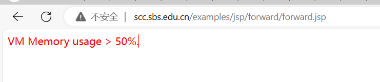
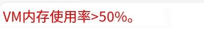
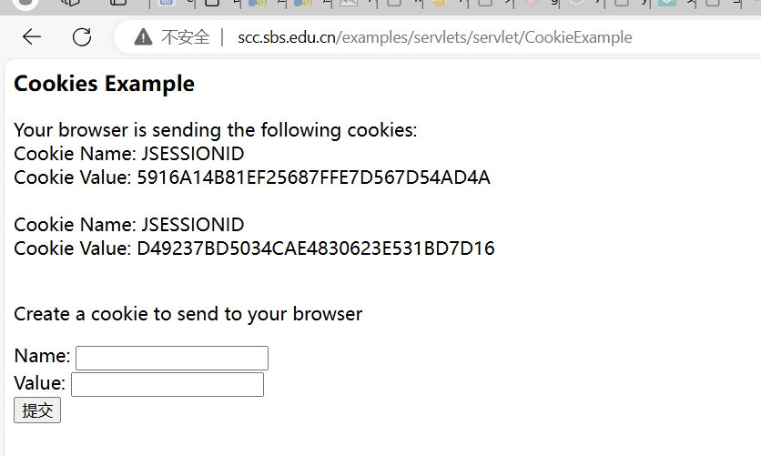
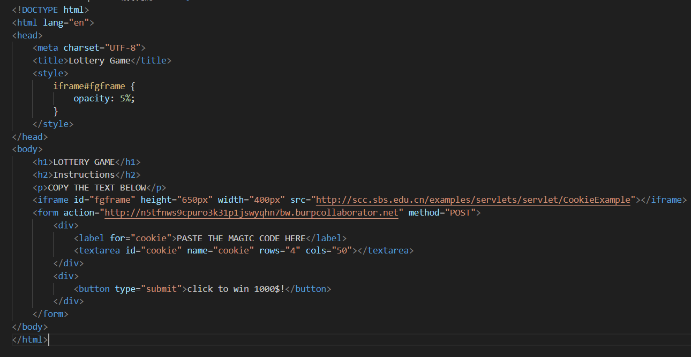
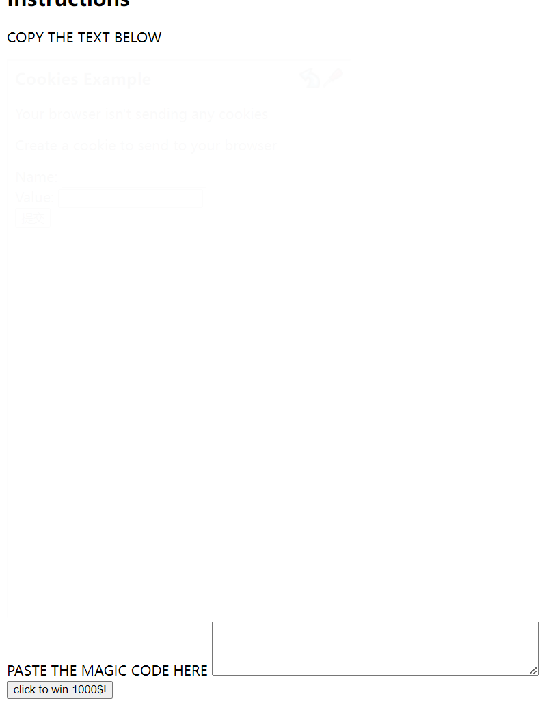

# 1.信息泄露漏洞

**第一个url链接 泄漏内容如下图**

**危害：** 可以监控服务器状态 等使用率占比搞的的时候 可以进行doss攻击导致服务器瘫痪

# 2.点击劫持漏洞

这个页面可以展示出自己的cookie值 可以进行cookie劫持,

当然了，你也可以把页面边框变成透明，或在上面添加一个重叠元素，使其更具伪装性。执行上述POC页面之后，我的控制端就成功收到了Cookie信息。

经过url编码后获得cookie信息